# 🗓️ Weekly Planner

**Author:** Gia Bao Bui  
**Purpose:** Technical assignment for IntegraDev – Demonstration of object-oriented design, clean architecture, and system evolvability in Java.

---

## Overview

This desktop application is a modular weekly planner designed with a focus on clean architecture, evolvability, and testability rather than full UI completeness.

Users can create tasks, set their properties, and generate a planned weekly schedule based on task attributes and user preferences (e.g., working hours).

The system's design highlights:

- A domain planner that encapsulates the core planning logic
- A layered architecture (JavaFX UI → Repository → DAO → Database)
- A domain layer with classes that hold no reference to the other layers to provide domain language and logic to the system

---

## Architecture

The application follows a **Layered Architecture** with **Ports & Adapters** pattern, ensuring clean separation of concerns and testability.

```mermaid
graph TB
    subgraph "UI Layer"
        UI["JavaFX Controllers"]
    end
    
    subgraph "Application Layer"
        APP["Use Cases<br/>PlanWeek, AddTask"]
    end
    
    subgraph "Domain Layer"
        subgraph "Model"
            DOMAIN_MODEL["Task<br/>Value Objects"]
        end
        subgraph "Ports"
            TASK_REPO["TaskRepository<br/>Interface"]
        end
    end
    
    subgraph "Infrastructure Layer"
        subgraph "Persistence"
            TASK_ENTITY["TaskEntity"]
            TASK_MAPPER["TaskMapper<br/>Task ↔ TaskEntity"]
            REPO_IMPL["TaskRepositoryImpl<br/>implements TaskRepository"]
            DAO["DAO (ORMLite)"]
            DB[("SQLite Database")]
        end
    end
    
    UI --> APP
    APP --> TASK_REPO
    TASK_REPO -.-> REPO_IMPL
    REPO_IMPL --> DAO
    DAO --> DB
    REPO_IMPL --> TASK_MAPPER
    TASK_MAPPER --> DOMAIN_MODEL
    TASK_MAPPER --> TASK_ENTITY
    
    classDef domainClass fill:#e1f5fe
    classDef infraClass fill:#f3e5f5
    classDef uiClass fill:#e8f5e8
    
    class DOMAIN_MODEL,TASK_REPO domainClass
    class TASK_ENTITY,TASK_MAPPER,REPO_IMPL,DAO,DB infraClass
    class UI,APP uiClass
```



**Key Architectural Principles:**

- **Domain Layer** (innermost): Contains business logic with no framework dependencies
- **Application Layer**: Orchestrates use cases and coordinates between UI and domain
- **Infrastructure Layer**: Implements ports and handles external concerns (database, UI)
- **Dependency Inversion**: Outer layers depend on inner layers through interfaces

---

## UI Design (For easier layout creation)

**UI/UX Design:** [Figma Design Link](https://www.figma.com/design/uctfbOuwrb6pDweWiQjaAN/Weekly-Planner?node-id=0-1&t=Hz5tYzjscCOHr4oB-1)

---

## Key Features

- Task creation and management
- Task prioritization and status tracking
- Weekly planning algorithm
- Clean architecture implementation
- Repository pattern with ORM integration

---

## Current Progress

The application has demonstrated a working flow from the UI → Application → Repository → DAO → SQLite Database.

**Completed Components:**

- Domain model and repositories
- Application services (use cases)
- Persistence layer with ORMLite
- Basic JavaFX UI for task creation
- Database configuration and initialization

---

## Tech Stack

- **Language:** Java 11
- **UI:** JavaFX
- **ORM:** ORMLite
- **Database:** SQLite
- **Build Tool:** Maven
- **Architecture:** Layered architecture with domain-driven design principles
- **Future:** Docker

---

## 🧪 How to Exercise the Use Cases

Run through this checklist when validating the project. Each section provides specific commands to test different aspects of the application.

### 🚀 Quick Start

```bash
# 1. Initialize the database and launch the GUI
./mvnw javafx:run
```

### 🎯 Core Use Cases Testing

#### **Task Management**

```bash
# Test adding tasks through the GUI (full UI → Database flow)
./mvnw clean javafx:run
# Then use the "Add Task" form to create tasks and verify persistence
```

```bash
# Test the calendar visualisation using the console app
java -cp "target/classes:$(./mvnw dependency:build-classpath -Dmdep.outputFile=/dev/stdout -q)" com.example.weeklyplanner.console.WeeklyPlanConsoleDemo
```


#### **Weekly Planning Algorithm**

```bash
# Test the core planning logic independently
java -cp "target/classes:$(./mvnw dependency:build-classpath -Dmdep.outputFile=/dev/stdout -q)" org.junit.runner.JUnitCore com.example.weeklyplanner.test.application.TestPlanWeekService
```


#### **Task Viewing & Backlog Management**

```bash
# Test backlog retrieval
java -cp "target/classes:$(./mvnw dependency:build-classpath -Dmdep.outputFile=/dev/stdout -q)" org.junit.runner.JUnitCore com.example.weeklyplanner.test.application.TestViewBacklogService

# Test weekly calendar view
java -cp "target/classes:$(./mvnw dependency:build-classpath -Dmdep.outputFile=/dev/stdout -q)" org.junit.runner.JUnitCore com.example.weeklyplanner.test.application.TestViewCurrentWeeklyCalendarService
```

### 🔧 Infrastructure & Persistence Testing

#### **Database Operations**

```bash
# Test database connectivity and task retrieval
java -cp "target/classes:$(./mvnw dependency:build-classpath -Dmdep.outputFile=/dev/stdout -q)" org.junit.runner.JUnitCore com.example.weeklyplanner.test.persistence.db.TestDatabase

# Test repository integration
java -cp "target/classes:$(./mvnw dependency:build-classpath -Dmdep.outputFile=/dev/stdout -q)" org.junit.runner.JUnitCore com.example.weeklyplanner.test.persistence.repository.PlanEntryRepositoryIntegrationTest
```

#### **Data Mapping & Transformation**

```bash
# Test entity-to-domain mapping
java -cp "target/classes:$(./mvnw dependency:build-classpath -Dmdep.outputFile=/dev/stdout -q)" org.junit.runner.JUnitCore com.example.weeklyplanner.test.persistence.mapper.PlanEntryMapperTest
java -cp "target/classes:$(./mvnw dependency:build-classpath -Dmdep.outputFile=/dev/stdout -q)" org.junit.runner.JUnitCore com.example.weeklyplanner.test.persistence.mapper.UserPreferenceMapperTest
java -cp "target/classes:$(./mvnw dependency:build-classpath -Dmdep.outputFile=/dev/stdout -q)" org.junit.runner.JUnitCore com.example.weeklyplanner.test.persistence.mapper.WeeklyPlanMapperTest
```

#### **Repository Layer**

```bash
# Test weekly plan repository
java -cp "target/classes:$(./mvnw dependency:build-classpath -Dmdep.outputFile=/dev/stdout -q)" org.junit.runner.JUnitCore com.example.weeklyplanner.test.persistence.repository.WeeklyPlanRepositoryTest

# Test user preference repository
java -cp "target/classes:$(./mvnw dependency:build-classpath -Dmdep.outputFile=/dev/stdout -q)" org.junit.runner.JUnitCore com.example.weeklyplanner.test.persistence.repository.UserPreferenceRepositoryTest
```

### 🔄 Complete Test Suite

```bash
# Run all tests to verify the entire system (ordered by architecture layers)
java -cp "target/classes:$(./mvnw dependency:build-classpath -Dmdep.outputFile=/dev/stdout -q)" org.junit.runner.JUnitCore com.example.weeklyplanner.test.persistence.db.TestDatabase com.example.weeklyplanner.test.persistence.repository.PlanEntryRepositoryIntegrationTest com.example.weeklyplanner.test.persistence.mapper.PlanEntryMapperTest com.example.weeklyplanner.test.persistence.mapper.UserPreferenceMapperTest com.example.weeklyplanner.test.persistence.mapper.WeeklyPlanMapperTest com.example.weeklyplanner.test.persistence.repository.WeeklyPlanRepositoryTest com.example.weeklyplanner.test.persistence.repository.UserPreferenceRepositoryTest com.example.weeklyplanner.test.application.TestViewBacklogService com.example.weeklyplanner.test.application.TestPlanWeekService com.example.weeklyplanner.test.application.TestViewCurrentWeeklyCalendarService

# Run individual test suites
java -cp "target/classes:$(./mvnw dependency:build-classpath -Dmdep.outputFile=/dev/stdout -q)" org.junit.runner.JUnitCore com.example.weeklyplanner.test.application.TestPlanWeekService
java -cp "target/classes:$(./mvnw dependency:build-classpath -Dmdep.outputFile=/dev/stdout -q)" org.junit.runner.JUnitCore com.example.weeklyplanner.test.application.TestViewBacklogService
java -cp "target/classes:$(./mvnw dependency:build-classpath -Dmdep.outputFile=/dev/stdout -q)" org.junit.runner.JUnitCore com.example.weeklyplanner.test.persistence.db.TestDatabase
```

### 🗄️ Database Inspection

```bash
# Initialize/reset the database
java -cp "target/classes:$(./mvnw dependency:build-classpath -Dmdep.outputFile=/dev/stdout -q)" com.example.weeklyplanner.persistence.db.DatabaseInitializer

# Inspect SQLite database (if sqlite3 is installed)
sqlite3 planner-database
.tables
SELECT * FROM task;
SELECT * FROM weekly_plan;
SELECT * FROM user_preference;
.quit
```

## Notes

This submission prioritizes architecture quality, extensibility, and domain design clarity over visual polish. The codebase demonstrates my approach to incremental feature development, clean abstraction, and maintainable OOP design under time constraints.
